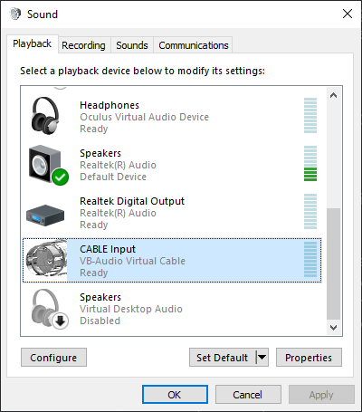
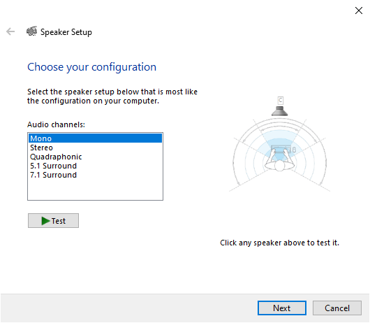
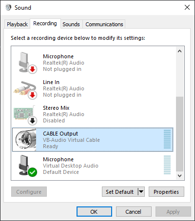

# Android Microphone

Use your Android phone as a microphone to Windows PC

__Idea__  
You have a Windows desktop PC but do not have a mic (or have a Sony bluetooth headset whose mic cannot be detected by Windows like me), you may need to buy a new cabled headset with a mic. However, you also have an Android phone which you use to chat with your friends everyday. So, why not use your Android phone as a mic for your PC?

------

### Requirements  
* Android phone with bluetooth  
* Windows PC with bluetooth  
* PC and phone are paired once  
* Installed [Virtual Audio Cable (VAC)](https://vac.muzychenko.net/en/) on Windows, will hear "trial" voice if your driver is in trial mode  
  I'm actually using [VB-Audio](https://vb-audio.com/Cable/) as alternative now since it is completely free  

------

### How to use  

1. Run Windows side application first, click `connect` to start server  
2. Next launch Android side application, click `connect` and enable `microphone`  
3. Select audio speaker from drop down list to the one that VAC (or VB) created  
     
     
4. Use the corresponding microphone created by VAC (or VB)  
     

That's all!  

------

### Future Feature Plan  

- [x] Windows app can minimize to system tray  
- [x] Volume control on Windows side  
- [x] Audio visualization on Windows side  
- [ ] Audio visualization on Android side  
- [ ] USB serial port connection support  
- [ ] Make Android side able to run in background  
- [ ] Show notification when mic is in use on Android side  

------

### Releases

Pre-built installers can be found [here](https://github.com/teamclouday/AndroidMic/releases)  