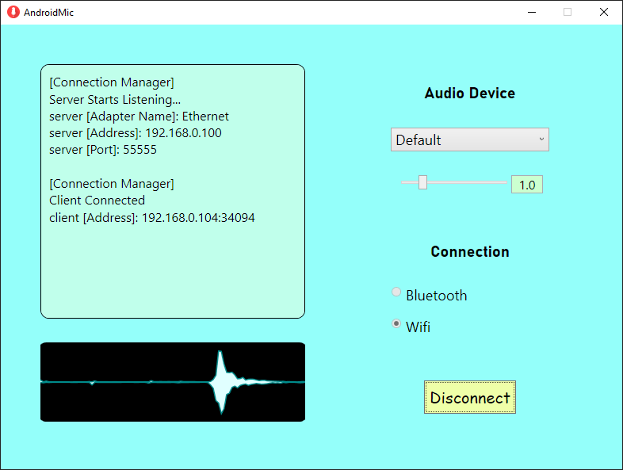
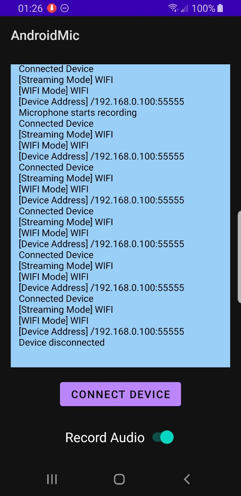

# Android Microphone

Use your Android phone as a microphone to Windows PC

__Idea__  
You have a Windows desktop PC but do not have a mic (or have a Sony bluetooth headset whose mic cannot be detected by Windows like me), you may need to buy a new cabled headset with a mic. However, you also have an Android phone which you use to chat with your friends everyday. So, why not use your Android phone as a mic for your PC?

------

### Requirements  
* Android phone with bluetooth (or USB tethering)  
* Windows PC with bluetooth  
* PC and phone are paired once  
* Installed [Virtual Audio Cable (VAC)](https://vac.muzychenko.net/en/) on Windows, will hear "trial" voice if your driver is in trial mode  
  I'm actually using [VB-Audio](https://vb-audio.com/Cable/) as alternative now since it is completely free  

------

### How to use  

_Bluetooth Method_:  

1. Run Windows side application first, click `connect` to start server  
2. Next launch Android side application, click `CONNECT BLUETOOTH` and enable `microphone`  
3. Select audio speaker from drop down list to the one that VAC (or VB) created  
     
4. Use the corresponding microphone created by VAC (or VB)  
     

_USB Method_:  
1. Connect phone with PC by cable  
2. Enable USB tethering on Android  
3. (Optional) Change connected network priority so that PC will not consume all your phone's network  
4. Launch Windows app and select your server IP address assigned by the USB network (find in `Settings`->`Network & Internet`->`Ethernet`->Click->`Properties`->`IPv4 address`)  
5. On Android side, click `CONNECT USB` and enter the same IP you selected on Windows side  
6. Enable microphone and select audio device following the same steps in bluetooth method  

That's all!  

------

### Future Feature Plan  

- [x] Windows app can minimize to system tray  
- [x] Volume control on Windows side  
- [x] Audio visualization on Windows side  
- [x] USB serial port connection support  
- [ ] Limit fps of the waveform visualization update  
- [ ] Make Android side able to run in background  
- [ ] Show notification when mic is in use on Android side  
- [ ] Post audio effects options  

------

### Releases

Pre-built installers can be found [here](https://github.com/teamclouday/AndroidMic/releases)  

------

### Windows Side

### Android Side (Portrait)

### Android Side (Landscape)

