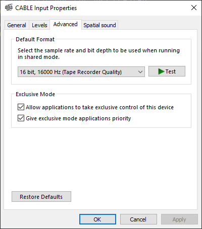
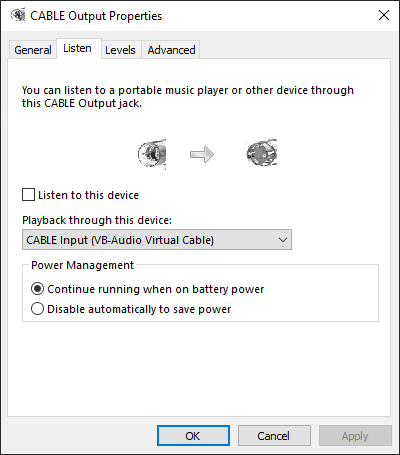

# Android Microphone

Use your Android phone as a microphone to Windows PC

------

## Requirements  
* Android phone with bluetooth/wifi  
* Windows PC with bluetooth/wifi  
* Installed [Virtual Audio Cable (VAC)](https://vac.muzychenko.net/en/) on Windows, will hear "trial" voice if your driver is in trial mode  
  I'm actually using [VB-Audio](https://vb-audio.com/Cable/) as alternative now since it is completely free  

------

## How to use  

Config Audio Device

1. Run Windows side app  
2. Select audio speaker from drop down list to the one that VB created  
     
3. Use the corresponding microphone created by VB  
     
4. In `Properties` of both, make sure both set default format to following:  
     
5. For speaker, click `Configure Speakers` and set channel to `Mono`:  
     
6. For microphone, click `Properties` and set following:  
   

On my machine, this setup has the lowest delay and best sound quality. VB is not optimized as hardware devices, so these configurations are important for audio.

Volume Control

1. Run Windows side app  
2. Drag slider to control volune  

Connection: Bluetooth

1. Make sure PC and phone are paired once  
2. Check `Bluetooth` button on Windows app  
3. Click `Connect` on Windows app to start server  
4. Click `Connect` on Android app to connect  
5. Tap `Record Audio` on Android app to start transferring audio  

Connection: Wifi

1. Make sure PC and phone are under the same network  
   1. Can be under the same router with Wifi  
   2. Can have PC connected to ethernet of the same router  
   3. Can have PC connected to phone by cable and enable USB tethering on phone  
   4. USB tethering may not work if it is not the first available network  
2. Click `Connect` on Windows app to start server  
3. Click `Connect` on Android app to connect  
4. Enter `IP` and `Port` (displayed on Windows side) on Android app  
5. Tap `Record Audio` on Android app to start transferring audio  

Advanced Filters

1. Run Windows side app  
2. Connect phone to app  
3. Click `Advanced Effects` to open advanced settings window  
4. Expand a filter and check `enabled` to test effects  

__Pitch Shifter__:  
* Slider controls pitch shift factor  

__White Noise__:  
* Slider controls the noise strength  

__Repeat Track__:  
* Check `Repeat` to enable looped audio track  
* Slider controls audio track volume strength  
* `Select File` to select an audio file to play  

__SpeexDSP Filters__:  
* Check corresponding filters to enable/disable   
* If Echo Cancellation does not work (your friend hears echo from your speaker)  
  Try re-enable echo cancellation to restart cancellation state  
  Echo Cancellation may take a while (5-10s) to optimize  

------

## Feature Plans  

- [x] Windows app can minimize to system tray  
- [x] Volume control on Windows side  
- [x] Audio visualization on Windows side  
- [x] Show notification when mic is in use on Android side  
- [x] ~~Implement Acoustic Echo Cancellation (AEC)~~  
- [ ] Audio effect filters (Not yet released)  
  - [x] Pitch Shifter  
  - [x] Add White Noise  
  - [x] Repeated Background Track  
  - [x] SpeexDSP Noise Cancellation  
  - [x] SpeexDSP Automatic Gain Control  
  - [x] SpeexDSP Voice Activity Detection  
  - [x] SpeexDSP Echo Cancellation  
  - [ ] To be continued  

Check out [Avalonia](https://github.com/AvaloniaUI/Avalonia)! With this it may be possible to port all Windows code to .Net Core that can be compiled to support Linux/MacOS!

------

## Releases

Pre-built installers can be found [here](https://github.com/teamclouday/AndroidMic/releases)  

------

## Windows Side

## Android Side (Portrait)

## Android Side (Landscape)

