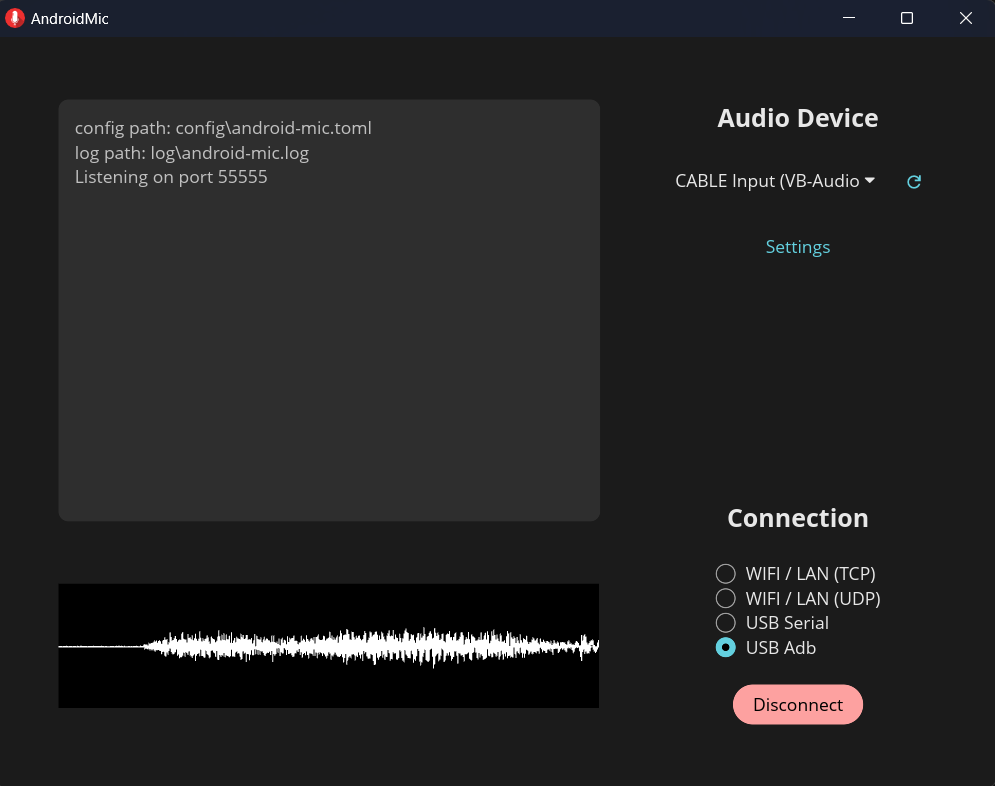
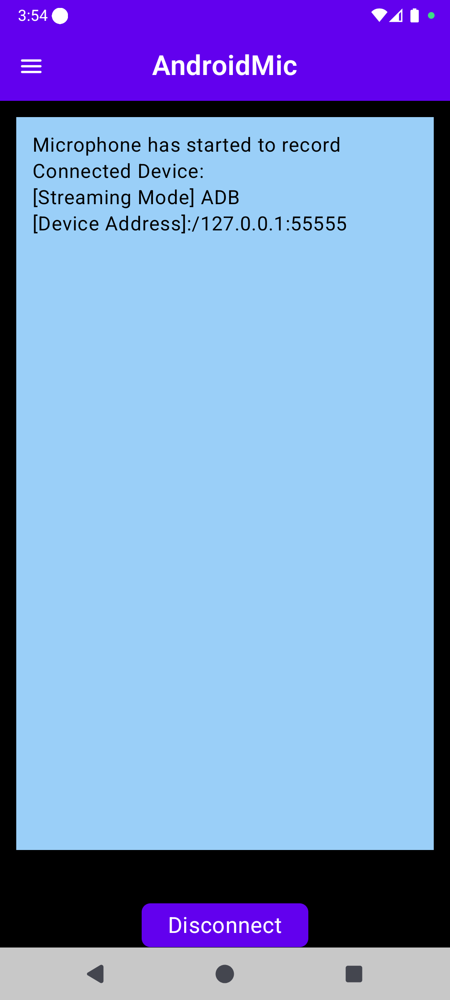

<p align="center">
  
  <h1 align="center" style="display: inline-block; margin-left: 12px; vertical-align: middle;">AndroidMic</h1>
</p>

<h3 align="center">Use your Android phone as a microphone for your PC</h3>

<!-- <a href="https://flathub.org/apps/io.github.teamclouday.AndroidMic"></a> -->
[](https://github.com/teamclouday/AndroidMic/releases/latest)
[](https://f-droid.org/packages/io.github.teamclouday.AndroidMic)

---

<p  style="text-align: center;">
  
  
</p>

# Features

- Multiplatform (Linux, Windows, MacOs)
- Wifi and USB support
- Noise Cancellation
- Audio wave visualization
- Advanced Audio Options

# How to Use

## PC Side

- **1. Start the app**: Download and install the latest release. Then start the app.
    <details>
    <summary>
    More about installation
    </summary>

  On macOS, you will need to run the following command to allow the app to run. For more details, refer to this [link](https://discussions.apple.com/thread/253714860?sortBy=best):

  ```sh
  xattr -c /Applications/AndroidMic.app
  ```

    </details>

- **2. Pick an output audio device**: You will see a list of audio player devices from the dropdown list. Here you want to choose a device that is wired to the virtual mic device on your system that you will be using.

    <details>
    <summary>
    More about output device
    </summary>

  The step is system independent.

  On Windows you can use [Virtual Audio Cable](https://vac.muzychenko.net/en/download.htm) or [VB Cable](https://vb-audio.com/Cable/). Both software will install virtual input and output audio devices on your system. After that map the output player device to the input mic device so any audio our app played to the device is transferred to the virtual mic device.

  On Linux you can use pulseaudio to create a virtual mic device.

    </details>

- **3. Choose a connection method**: This is how your phone will be connected to your PC and stream audio from the mic.

  For TCP & UDP, connect your phone and PC to the same internet.

  For USB serial, connect your phone to PC with a cable.

    <details>
    <summary>
    More about USB serial
    </summary>

  This option also requires configurations that are system independent.

  On Windows, make sure the adb process is shutdown and android studio is closed.

  On MacOS, it should just work.

  On Linux, you will need to configure [udev](https://github.com/libusb/libusb/wiki/FAQ#can-i-run-libusb-applications-on-linux-without-root-privilege) so that the app has permission to use USB.

  Samsung phone users may need to use [zadig](https://zadig.akeo.ie/) to change the USB driver to WinUSB. This is because by default Samsung phones use its proprietary USB driver which is not compatible with the app.

    </details>

  For USB adb, make sure the system has installed [adb](https://developer.android.com/tools/adb). The connect your phone to PC.

- **4. Configure advanced settings**: Click to open the advanced settings window, and pick an audio format the output audio device supports. Usually sample rate of 44.1k or 48k, mono channel, and i16 or i24 are supported.

## Android Side

- **1. Start the app**: Download and install the apk file from release page. Then open the app.

- **2. Configure the app**: Open the side drawer menu, configure the connection method according to the option on PC app. Then pick the **same audio settings** as the ones in PC app advanced settings.

- **3. Connect**: First start recording and give sufficient permissions. Recording permission for accessing your phone's mic. Notification permission so the app can let you know if it is still recording in the background. Then connect to the PC app.

    <details>
    <summary>More about connection configurations</summary>

  For TCP/UDP, you will need to enter the PC address and port. You can find that information from the log area on PC app.

  For USB adb, set your phone to developer mode and enable USB debugging.

  For USB serial, make sure your phone's USB setting is charging only. With this option, the app will ask your permission to launch the app in accessory mode.

    </details>

---

For more question / feature request / bug report, please [submit an issues](https://github.com/teamclouday/AndroidMic/issues).

---

## Some Notes

The PC app started as a WPF app written in C# and was only supported on Windows. Now most of the features are recreated in Rust app thanks to @wiiznokes and it's cross platform supported. But here's the [link to the WPF app branch](https://github.com/teamclouday/AndroidMic/tree/wpf-app-backup) in case you are interested.

Bluetooth is no longer supported because USB serial is made possible.
